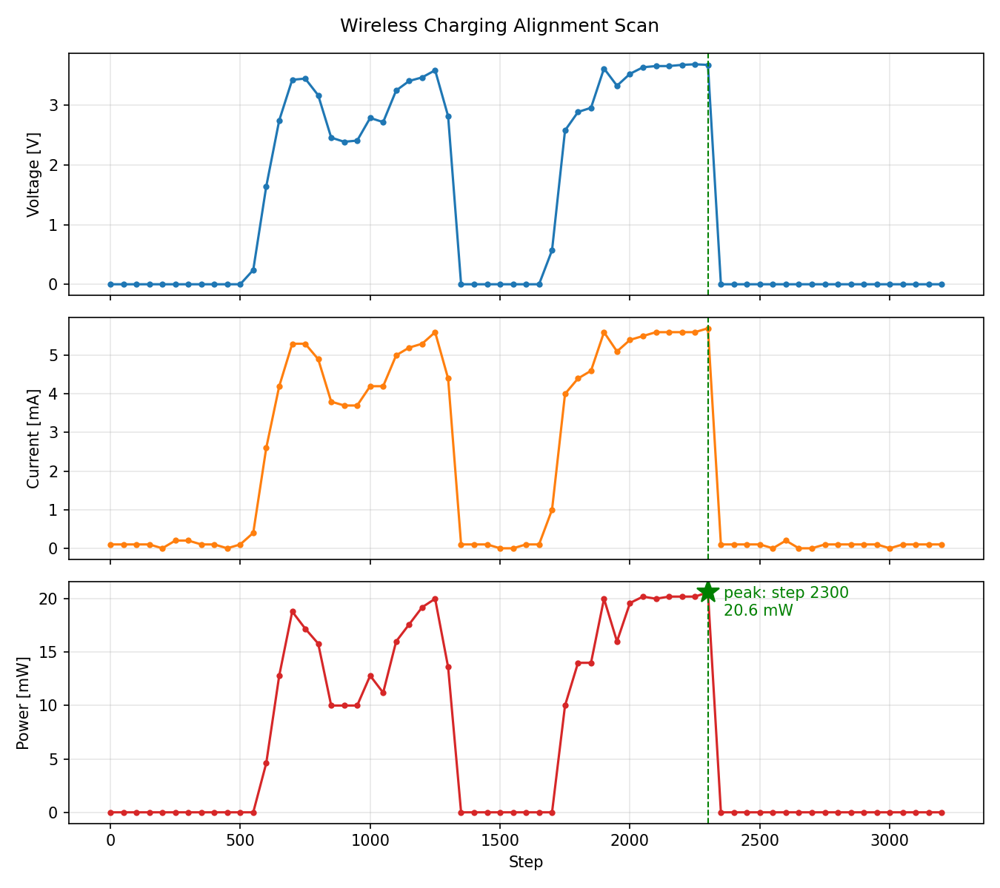

# Digital Twin-Based Mobile Wireless EV Charging System

> 한이음 드림업 팀 **백만볼트**가 개발한 XY·Z축 이동형 무선 전기차 충전 프로토타입

주차된 차량의 위치로 송신 코일을 자동 이송하고, 전력 측정값을 이용해 코일 정렬 상태를 확인한 뒤 무선 충전을 수행하는 시스템입니다.  
이 저장소는 프로젝트에서 제작한 **모터 제어 펌웨어, 주차 감지, 전력 측정, 정밀 정렬 도구와 실험 결과**를 기능별로 정리합니다.

## 프로젝트 목표

고정형 충전기에 차량이 맞춰 이동하는 대신, 충전 장치가 차량이 있는 주차 구역으로 이동하도록 설계했습니다.

- 주차 구역 입력에 따른 XY 레일 자동 이동
- Z축 승강과 충전 송신부 릴레이 제어
- 리미트 스위치를 이용한 원점 복귀 및 이동 범위 보정
- INA219 전압·전류·전력 측정
- 전력 피크를 이용한 송·수신 코일 정밀 정렬
- 초음파 센서를 이용한 주차 구역 차량 감지
- Unity 기반 디지털 트윈 및 차량 충전 스케줄링 연동

## 전체 동작 흐름

```text
차량 및 주차 구역 등록
        ↓
충전 대상과 이동 목표 구역 결정
        ↓
XY 레일 원점 확인 및 목표 좌표 이동
        ↓
Z축 상승 → 송신 코일 접근
        ↓
충전 릴레이 ON
        ↓
INA219 전력 측정 및 코일 위치 스캔
        ↓
최대 전력 위치로 복귀
        ↓
충전 상태 모니터링 및 디지털 트윈 반영
```

## 시스템 구성

| 서브시스템 | 담당 기능 | 주요 장치 |
|---|---|---|
| XY Motion Controller | 주차 구역 좌표 이동, 호밍, 재측정, 비상 정지 | OrangeBoard, DFRobot Stepper Shield, 리미트 스위치 |
| Z-Axis & Relay Controller | 충전 코일 승강 및 송신부 전원 제어 | Arduino Nano, 스텝모터, A4988/CNC Shield, 릴레이 |
| Power Sensing Node | 수신부 전압·전류·전력 측정 및 전송 | Arduino Nano, INA219, HC-06 |
| Alignment Coordinator | 위치별 전력 측정, 최대 전력 지점 탐색 및 복귀 | Python, PySerial, Matplotlib |
| Parking Sensor Node | 6개 주차 구역 차량 유무 감지 | Arduino Uno, 초음파 센서 6개 |
| Digital Twin | 실물 장치 상태 시각화 및 충전 스케줄링 | Unity, C# |

## 저장소 구조

```text
.
├─ firmware/
│  ├─ xy_motion/
│  │  ├─ xy_zone_controller/xy_zone_controller.ino
│  │  └─ xy_axis_calibration/xy_axis_calibration.ino
│  ├─ z_axis/
│  │  └─ z_axis_relay_controller/z_axis_relay_controller.ino
│  ├─ alignment/
│  │  └─ alignment_motion_executor/alignment_motion_executor.ino
│  ├─ power_monitor/
│  │  └─ ina219_bluetooth_power_node/ina219_bluetooth_power_node.ino
│  └─ parking_sensor/
│     └─ six_bay_ultrasonic_detector/six_bay_ultrasonic_detector.ino
├─ apps/
│  ├─ unity-digital-twin/
│  │  ├─ Assets/
│  │  ├─ Packages/
│  │  └─ ProjectSettings/
│  └─ kiosk/
│     ├─ app.py
│     ├─ requirements.txt
│     ├─ static/
│     └─ templates/
├─ tools/
│  └─ alignment/
│     └─ coil_alignment_power_scan.py
├─ results/
│  └─ alignment/
│     └─ scan_log.csv
├─ docs/
│  └─ images/
│     └─ alignment_power_scan.png
└─ archive/
   └─ prototypes/
      ├─ stepper_motor_step_counter/stepper_motor_step_counter.ino
      ├─ xy_zone_controller_limit_switch_version/xy_zone_controller_limit_switch_version.ino
      └─ ina219_unity_stream_legacy/ina219_unity_stream_legacy.ino
```

## 코드별 역할

### 최종·통합 코드

| 파일 | 역할 |
|---|---|
| [xy_zone_controller.ino](firmware/xy_motion/xy_zone_controller/xy_zone_controller.ino) | A1~C6 주차 구역 이동, 원점 복귀, 조그, 비상 정지, 최대 스텝 재측정을 통합한 XY축 제어 코드 |
| [xy_axis_calibration.ino](firmware/xy_motion/xy_axis_calibration/xy_axis_calibration.ino) | X·Y축의 MIN/MAX 리미트 스위치를 이용해 전체 이동 스텝수를 반복 측정하는 캘리브레이션 코드 |
| [z_axis_relay_controller.ino](firmware/z_axis/z_axis_relay_controller/z_axis_relay_controller.ino) | Z축 상승·하강, 충전 송신부 릴레이 ON/OFF, 비상 정지를 처리하는 코드 |
| [ina219_bluetooth_power_node.ino](firmware/power_monitor/ina219_bluetooth_power_node/ina219_bluetooth_power_node.ino) | INA219 측정값을 USB 또는 HC-06으로 스트리밍하고 정밀 정렬용 평균값을 응답하는 코드 |
| [alignment_motion_executor.ino](firmware/alignment/alignment_motion_executor/alignment_motion_executor.ino) | Python 정밀 정렬 프로그램의 상대·절대 이동 명령을 실행하는 모터 제어 코드 |
| [six_bay_ultrasonic_detector.ino](firmware/parking_sensor/six_bay_ultrasonic_detector/six_bay_ultrasonic_detector.ino) | 6개 초음파 센서로 각 주차 구역의 차량 존재 여부를 판정하는 코드 |
| [coil_alignment_power_scan.py](tools/alignment/coil_alignment_power_scan.py) | 모터와 전력 센서의 두 시리얼 포트를 조정하여 위치별 전력을 측정하고 최대 전력 위치로 복귀하는 프로그램 |

### 실험·이전 버전

`archive/prototypes/`에는 최종 통합 전 단계에서 사용한 모터 스텝 계수, 리미트 스위치 적용 버전, Unity용 INA219 전송 형식 코드를 보존했습니다. 최종 동작 확인에는 위의 **최종·통합 코드**를 기준으로 사용합니다.

## 애플리케이션

### Unity 디지털 트윈

[apps/unity-digital-twin](apps/unity-digital-twin/)에는 Unity 프로젝트 실행에 필요한 `Assets`, `Packages`, `ProjectSettings`가 함께 들어 있습니다.

1. Unity Hub에서 **Add project from disk**를 선택합니다.
2. 저장소 최상위 폴더가 아니라 `apps/unity-digital-twin` 폴더를 지정합니다.
3. `Assets/Scenes/SampleScene.unity`를 엽니다.
4. 각 시리얼 브리지의 COM 포트를 현재 PC 환경에 맞게 확인합니다.

기존 Unity 파일과 `.meta` GUID를 그대로 보존했으므로 프로젝트 경로만 다시 지정하면 기존 씬과 리소스 연결이 유지됩니다.

### 차량 정보 입력 키오스크

[apps/kiosk](apps/kiosk/)에는 Flask·SQLite 기반 차량 정보 입력 화면과 차량 현황 화면이 들어 있습니다.

```bash
cd apps/kiosk
python -m venv .venv
.venv\Scripts\activate
pip install -r requirements.txt
python app.py
```

실행 후 `http://localhost:5000`에서 차량을 등록하고, `http://localhost:5000/status`에서 등록 현황을 확인할 수 있습니다.

## 주요 통신 명령

| 대상 | 명령 | 의미 |
|---|---|---|
| XY축 통합 제어 | `A1` ~ `C6` | 지정 주차 구역으로 이동 |
| XY축 통합 제어 | `h / t / j / r / s` | 원점 / 상태 / 조그 / 재측정 / 정지 |
| 정밀 정렬 실행기 | `M<n>` | 현재 위치 기준 상대 이동 |
| 정밀 정렬 실행기 | `G<n>` | 지정 절대 스텝 위치로 이동 |
| 정밀 정렬 실행기 | `Z` | 현재 위치를 0으로 설정 |
| INA219 센서 노드 | `m / s / R` | 연속 측정 / 중지 / 10회 평균 단발 측정 |
| Z축·릴레이 | `1 / 2 / 3 / 4 / s` | 상승 / 하강 / 충전 ON / 충전 OFF / 비상 정지 |

## 정밀 정렬 실험

Python 코디네이터가 일정 스텝 간격으로 모터를 이동시키고 각 위치에서 전압·전류·전력을 기록합니다. 측정이 끝나면 전력이 가장 높았던 스텝을 선택하고 해당 위치로 모터를 복귀시킵니다.



- 원본 측정 데이터: [scan_log.csv](results/alignment/scan_log.csv)
- 분석 프로그램: [coil_alignment_power_scan.py](tools/alignment/coil_alignment_power_scan.py)
- 필요 패키지: `pyserial`, `matplotlib`
- COM 포트와 스캔 범위는 프로그램 상단 설정값에서 실험 환경에 맞게 지정합니다.

## 개발 이력 브랜치

현재 `main`에는 핵심 펌웨어, Unity 디지털 트윈, 키오스크, 분석 도구와 실험 결과를 한 구조로 통합했습니다. 아래 브랜치는 통합 이전의 개발 과정을 보존하기 위한 이력입니다.

| 브랜치 | 통합된 위치 |
|---|---|
| [Han_Unity](https://github.com/kingjihwan/parking-system/tree/Han_Unity) | `apps/unity-digital-twin/` |
| [kiosk](https://github.com/kingjihwan/parking-system/tree/kiosk) | `apps/kiosk/` |
| [unity](https://github.com/kingjihwan/parking-system/tree/unity) | 이전 Unity 구현 |
| [정밀정렬-초안](https://github.com/kingjihwan/parking-system/tree/%EC%A0%95%EB%B0%80%EC%A0%95%EB%A0%AC-%EC%B4%88%EC%95%88) | 정밀 정렬 및 하드웨어 실험 이력 |

통합된 `main`에서 Unity와 키오스크가 정상 실행되는 것을 확인한 뒤, 불필요한 개발 브랜치는 태그로 보존하거나 삭제할 수 있습니다.

## 팀원 및 역할

| 팀원 | 역할 | 세부 담당 |
|---|---|---|
| 류영우 · 팀장 | Mechanical & Motion Control | 전체 하드웨어 구조, XY 레일 구동계, Z축 승강 기구, 모터 제어부 설계 및 통합 |
| 김상준 | Software Integration & Digital Twin | Unity 디지털 트윈, 사용자 앱·키오스크, 통신 계층과 소프트웨어 모듈 통합 |
| 설지환 | Sensors & Embedded Firmware | INA219·초음파·리미트 센서 선정과 결선, 개별 Arduino 펌웨어 및 센서 데이터 처리 |
| 이동민 | Integrated Embedded Control & Prototype | 종합 Arduino 제어 코드, 모터·센서·충전 시퀀스 연동, 축소형 주차장 모형 설계 |
| 김도현 | System Concept & Architecture | 프로젝트 아이디어 구체화, 전체 동작 시나리오와 시스템 아키텍처 설계 |

## 기술 스택

- Embedded: Arduino C/C++, OrangeBoard, Arduino Nano/Uno
- Motion: Stepper Motor, DFRobot Stepper Shield, A4988, Limit Switch
- Sensing: INA219, Ultrasonic Sensor
- Communication: USB Serial, HC-05/HC-06 Bluetooth SPP
- Analysis: Python, PySerial, Matplotlib
- Digital Twin: Unity, C#
- Application Prototype: Flask, SQLite, Supabase

## 파일 명명 규칙

- 파일명은 기능을 바로 알 수 있도록 영문 `snake_case`를 사용합니다.
- 실행 가능한 Arduino 코드는 `.ino`, Python 도구는 `.py` 확장자를 사용합니다.
- 최종 코드와 실험 코드를 각각 기능 폴더와 `archive/prototypes/`로 구분합니다.
- 파일명에는 복사본 번호, 작성 시점, 임시 표현 대신 **제어 대상 + 수행 기능**을 기록합니다.
